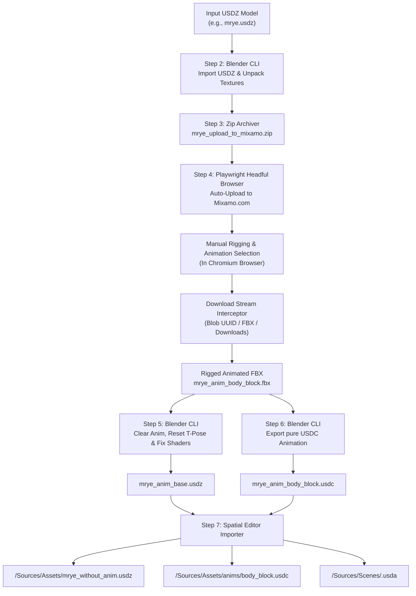

# Architecture & Implementation Specification: Pose Binder (`pose-binder`)

This document provides an in-depth technical specification of **Pose Binder** ([`pose_binder.py`](file:///Volumes/Workspace/gitrepos/dailystudio/frame-and-fable/xr/pose-binder/pose_binder.py)). It details the system architecture, Blender CLI background scripting, Playwright browser stealth automation, download interception mechanisms, math transforms, and Spatial Editor USDA scene generation algorithms.

---

## 🏗️ High-Level System Architecture



---

## 🔍 Detailed Implementation Breakdown

### 1. Phase 1: Input Preparation & USDZ $\rightarrow$ FBX Conversion (Steps 1–3)

#### **Step 2: USDZ Import & Embedded Texture Unpacking**
Blender's USD importer is invoked in background mode (`--background --python-expr`). The script imports the `.usdz` character model, saves a temporary `.blend` mainfile into the target directory, and calls Blender's native unpack operator:

```python
bpy.ops.wm.read_factory_settings(use_empty=True)
bpy.ops.wm.usd_import(filepath=usdz_input)

# Save temporary blend file so unpack_all places textures in out_dir/textures/
temp_blend = os.path.join(out_dir, 'temp.blend')
bpy.ops.wm.save_as_mainfile(filepath=temp_blend)
bpy.ops.file.unpack_all(method='WRITE_LOCAL')

# Export Mixamo-compatible FBX
bpy.ops.export_scene.fbx(
    filepath=fbx_out,
    use_selection=False,
    embed_textures=False,
    path_mode='AUTO'
)
```

#### **Step 3: Zip Packaging for Mixamo**
Mixamo requires a zip file containing the model `.fbx` and its associated texture maps under a `textures/` directory. The Python `zipfile` module archives `model.fbx` and all relative file paths inside `{xxx}_upload_to_mixamo/textures/`.

---

### 2. Phase 2: Playwright Headful Browser Automation & Intercept (Step 4)

Mixamo utilizes Google OAuth authentication and anti-bot measures that block standard automated headless browsers. Step 4 implements a stealth persistent context using Playwright.

#### **Stealth Browser Configuration & Profile Lock Cleanup**
Before launching Playwright, the script clears stale Chromium lock files (`SingletonLock`, `SingletonCookie`, `SingletonSocket`) to prevent profile lock crashes from previous aborted runs:

```python
user_data_dir = os.path.expanduser("~/.mixamo_browser_profile")
for lock in ["SingletonLock", "SingletonCookie", "SingletonSocket"]:
    lock_p = os.path.join(user_data_dir, lock)
    if os.path.islink(lock_p) or os.path.exists(lock_p):
        os.unlink(lock_p)

launch_kwargs = {
    "user_data_dir": user_data_dir,
    "headless": False,
    "accept_downloads": True,
    "ignore_default_args": ["--enable-automation"],
    "args": [
        "--disable-blink-features=AutomationControlled",
        "--disable-profile-error-dialogs",
        "--start-maximized",
        "--no-sandbox"
    ]
}
context = p.chromium.launch_persistent_context(**launch_kwargs)
page.add_init_script("Object.defineProperty(navigator, 'webdriver', {get: () => undefined})")
```

#### **Auto-Upload & Manual Rigging Interface**
The script monitors Mixamo's DOM for file input elements (`input[type='file']`) or the "Upload Character" button. When detected, it automatically populates the file input with `{xxx}_upload_to_mixamo.zip` and halts automated DOM clicks to allow the user to manually position rigging markers (chin, wrists, elbows, knees, groin).

#### **Multi-Source Download Interception & Stream Stability**
Mixamo triggers downloads via JavaScript `blob:` URLs, which Chromium saves as extensionless UUID files (e.g. `0f64e9eb-b0f2-449d-bb56-ec720a0d251c`) inside temporary directories.

The polling loop scans three concurrent sources:
1. **Playwright `page.on("download")` Event**: Blocks on `download.path()` until Chromium emits `DownloadCompleted`.
2. **Chromium Artifact Directory (`/var/folders/.../playwright-artifacts-*/`)**: Scans for newly created extensionless UUID files (`> 100KB`).
3. **User Downloads Folder (`~/Downloads`)**: Scans for `.fbx` or UUID downloads created or modified within the last 30 seconds.

To prevent premature browser closure while large downloads (5–15MB) are writing bytes to disk, `wait_for_file_completion` verifies that the file size remains constant for a stability period and has no temporary extension (`.crdownload`, `.tmp`):

```python
def wait_for_file_completion(filepath, min_size=50000, stability_sec=1):
    if not os.path.exists(filepath):
        return False
    if any(filepath.lower().endswith(ext) for ext in [".crdownload", ".tmp", ".part", ".download"]):
        return False
    last_size = -1
    stable_count = 0
    for _ in range(15):
        if os.path.exists(filepath):
            curr_size = os.path.getsize(filepath)
            if curr_size >= min_size and curr_size == last_size and curr_size > 0:
                stable_count += 1
                if stable_count >= stability_sec:
                    return True
            else:
                stable_count = 0
            last_size = curr_size
        time.sleep(1)
    return os.path.exists(filepath) and os.path.getsize(filepath) >= min_size
```

#### **DOM Animation Title Scraper**
When a UUID file is captured, the script queries Mixamo's active DOM elements to extract the user's selected animation title (e.g. `BODY BLOCK` $\rightarrow$ `Body Block`), producing the final FBX filename `{xxx}_anim_{yyy}.fbx`.

---

### 3. Phase 3: Base Mesh & Shader USDZ Export (Step 5)

#### **Pose Bone Transform Reset to Rest Position (T-Pose)**
Clearing `armature.animation_data.action = None` in Blender leaves pose bones frozen at frame 0's animation pose. To force the armature back into its true rest pose (T-pose), the script iterates over all pose bones in `armature.pose.bones` and resets all transform channels to identity:

```python
for obj in bpy.data.objects:
    if obj.type == 'ARMATURE':
        if obj.animation_data:
            obj.animation_data.action = None
            for track in list(obj.animation_data.nla_tracks):
                obj.animation_data.nla_tracks.remove(track)
        for pbone in obj.pose.bones:
            pbone.location = (0.0, 0.0, 0.0)
            pbone.rotation_quaternion = (1.0, 0.0, 0.0, 0.0)
            pbone.rotation_euler = (0.0, 0.0, 0.0)
            pbone.rotation_axis_angle = (0.0, 0.0, 1.0, 0.0)
            pbone.scale = (1.0, 1.0, 1.0)
if bpy.context.view_layer:
    bpy.context.view_layer.update()
```

#### **Principled BSDF Shader Node Re-Wiring**
Mixamo FBX imports often erroneously link texture maps to the **Emission** socket instead of **Base Color**, resulting in glowing or unlit rendering in USD viewers. The script inspects material node trees, reconnects image texture outputs to **Base Color**, and zeroes out Emission color and strength:

```python
for mat in bpy.data.materials:
    if not mat.use_nodes: continue
    nt = mat.node_tree
    # Re-link Image Texture to Base Color, set Emission = (0,0,0) & Strength = 0.0
```

---

### 4. Phase 4: Animation Only USDC Export (Step 6)

Step 6 exports pure skeletal animation data without geometry duplicates or materials.

#### **Action Track Title Preservation**
Blender's USD exporter authors the USD `SkelAnimation` prim path using `armature.animation_data.action.name`. By renaming the action to the exact Mixamo animation title prior to export, the resulting `.usdc` file contains a clean `SkelAnimation` prim:

```python
for obj in bpy.data.objects:
    if obj.type == 'ARMATURE' and obj.animation_data and obj.animation_data.action:
        obj.animation_data.action.name = anim_track_name

bpy.ops.wm.usd_export(
    filepath=usdc_out,
    export_meshes=True,
    export_animation=True,
    export_armatures=True,
    export_materials=False,
    export_normals=False,
    export_uvmaps=False,
    export_mesh_colors=False,
    export_lights=False,
    export_cameras=False
)
```

---

### 5. Phase 5: Spatial Editor Project Integration (Step 7)

Step 7 integrates generated USD assets into PICO Spatial Editor projects (`Sources/Assets/`, `Sources/Assets/anims/`, `Sources/Scenes/<SceneName>.usda`).

#### **USD Prim Path Resolution & Sanitization**
Inside `.usdc` files, Pixar USD converts spaces and special characters in action names to underscores (e.g. `Standing Greeting` $\rightarrow$ `Standing_Greeting`). Spatial Editor scene `.usda` files require exact matching between the `custom string path` in `AnimationResourceLibraryComponent` and the `SkelAnimation` prim inside the `.usdc`:

```python
usd_prim_name = re.sub(r"[\s\-\W]+", "_", anim_raw_name).strip("_")
# Generates: custom string path = "/root/Armature/Armature/Standing_Greeting_SkeletonAnimation"
```

#### **USDA Scene Composition Engine**
The script inspects `<project>/Sources/Scenes/<SceneName>.usda`:
- If the scene file does not exist, it creates a new scene containing the model prim `def "{xxx}"` at position `(0, 0, 0)` with its `AnimationResourceLibraryComponent`.
- If the scene file exists, it parses the block and inserts or updates `def SpatialStruct "{yyy}"` under the model's `AnimationResourceLibraryComponent`:

```usda
def "nan_ye_gde" (
    prepend references = @../Assets/nan_ye_gde_without_anim.usdz@
)
{
    quatf xformOp:orient = (0.7071068, -0.7071067, 0, 0)
    float3 xformOp:scale = (1, 0.99999994, 0.99999994)
    float3 xformOp:translate = (0, 0, 0)
    uniform token[] xformOpOrder = ["xformOp:translate", "xformOp:orient", "xformOp:scale"]

    over "Armature"
    {
        def SpatialComponent "AnimationResourceLibraryComponent"
        {
            uniform token info:id = "AnimationResourceLibraryComponent"

            def SpatialStruct "standing_greeting"
            {
                custom string[] clipNames = []
                custom uniform asset file = @../Assets/anims/standing_greeting.usdc@
                custom bool isDefault = 0
                custom string path = "/root/Armature/Armature/Standing_Greeting_SkeletonAnimation"
            }
        }
    }
}
```

---

## ⚖️ Licensing & Legal Considerations

| Component | License | Licensing Impact |
| :--- | :--- | :--- |
| **`pose_binder.py`** | MIT / Proprietary | Can be kept closed-source or released under any open/closed license. |
| **Blender Executable** | GPL v3 | Invoked purely via CLI subprocess (`subprocess.run`). Per FSF guidelines, command-line process boundaries do not extend GPL to external wrapper scripts. |
| **Playwright Library** | Apache 2.0 | Permissive commercial license. |
| **OpenUSD (`pxr`)** | Apache 2.0 | Permissive commercial license. |
| **Adobe Mixamo Assets** | Adobe Terms of Use | Assets can be freely used in commercial 3D applications, games, and VR/AR scenes. Raw standalone FBX assets cannot be resold on stock asset marketplaces. |
