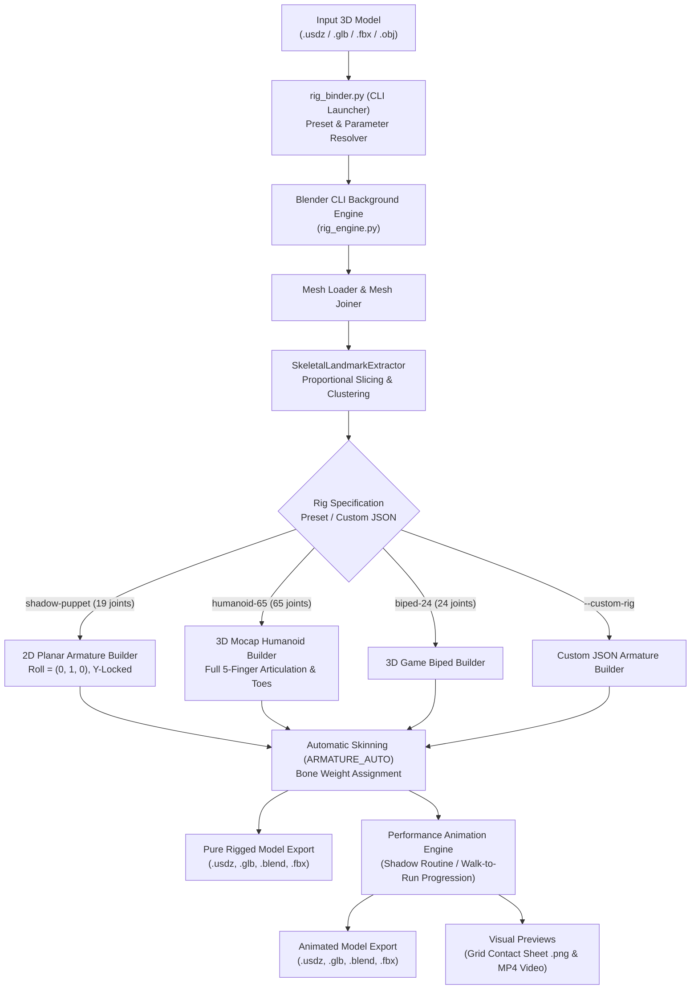

# Architecture & Implementation Specification: Rig Binder (`rig-binder`)

This document provides a technical specification of **Rig Binder** ([`rig_binder.py`](file:///Volumes/Workspace/gitrepos/dailystudio/frame-and-fable/xr/rig-binder/rig_binder.py), [`rig_engine.py`](file:///Volumes/Workspace/gitrepos/dailystudio/frame-and-fable/xr/rig-binder/rig_engine.py)). It explains the architecture of the generalized rigging system, proportional anatomical landmark extraction, 2D planar vs 3D skeletal generators, automatic weight binding, animation engines, and multi-format exporters.

---

## 🏗️ System Architecture



---

## 🔍 Core Component Details

### 1. Anatomical Landmark Extraction (`SkeletalLandmarkExtractor`)

The landmark extractor takes the world-space vertices of the unified mesh and computes proportional slices and spatial point clusters:

1. **Bounding Volume & Dimensions**:
   - $X_{min}, X_{max}$ (Width)
   - $Y_{min}, Y_{max}$ (Depth)
   - $Z_{min}, Z_{max}$ (Height)
2. **2D vs 3D Projection**:
   - In 2D Planar mode (`type == "planar_2d"`), all anatomical pivots have their Y coordinate projected to $Y_{center} = \frac{Y_{min} + Y_{max}}{2}$ to eliminate depth jitter and keep puppetry flat on the screen.
   - In 3D mode (`type == "standard_3d"`), volumetric centroids preserve front-to-back positions (e.g. eyes, jaw, toes).
3. **5-Finger Chain Articulation Algorithm**:
   - For hand pivots, the system determines the hand ray $\vec{d} = \frac{\text{Hand} - \text{Wrist}}{\|\text{Hand} - \text{Wrist}\|}$.
   - It distributes 5 articulated rays (Thumb, Index, Middle, Ring, Pinky), each decomposed into 3 proportional segments (01 metacarpal/proximal, 02 intermediate, 03 distal) and a tip anchor.

### 2. Universal Armature Builder (`UniversalArmatureBuilder`)

1. **Bone Creation**: Iterates over bones defined in the JSON configuration, resolving `head_key` and `tail_key` from the extracted landmark dictionary or applying relative coordinate offsets.
2. **Hierarchy Linking**: Connects child edit bones to their parent bones.
3. **Planar Constraint Enforcement**:
   - For 2D rigs, sets `b.align_roll((0, 1, 0))` on all edit bones.
   - In Pose mode, locks rotation on local X and Y axes (`b.lock_rotation[0] = True`, `b.lock_rotation[1] = True`) and locks translation on the depth axis (`b.lock_location[1] = True`).

### 3. Automatic Skinning & Weighting

- Meshes are parented to the generated armature using Blender's harmonic heat bone weighting:
  ```python
  bpy.ops.object.parent_set(type='ARMATURE_AUTO')
  ```
- Creates one vertex group per deform bone, binding vertex influences smoothly across joint connections.

### 4. Multi-Format Exporter

Exports the active scene with deformation bones and animations:
- **USDZ**: `bpy.ops.wm.usd_export` (Apple Vision Pro, iOS AR, Spatial Editor)
- **GLB**: `bpy.ops.export_scene.gltf` (Web 3D, Three.js, Godot, Babylon.js)
- **Blend**: `bpy.ops.wm.save_as_mainfile` (Native Blender project)
- **FBX**: `bpy.ops.export_scene.fbx` (Unity, Unreal Engine, Maya)
